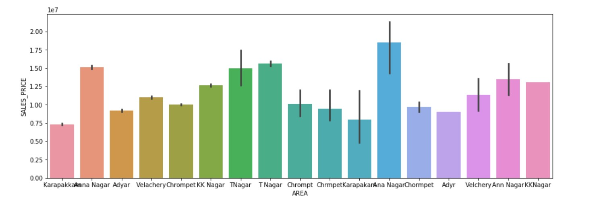
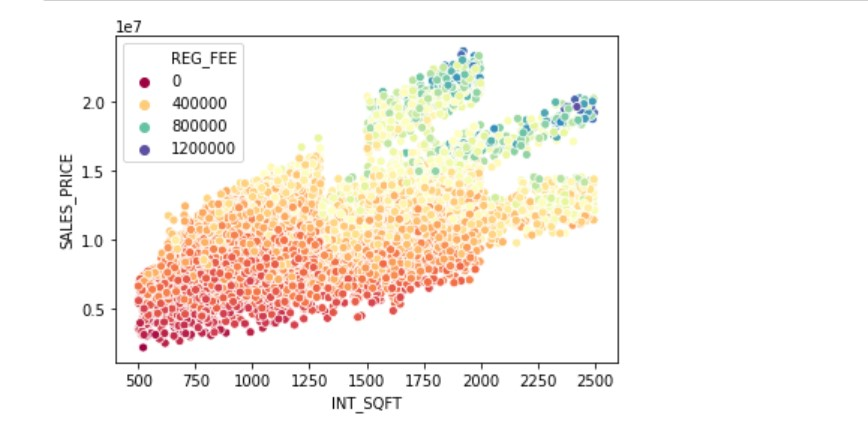

# House-Price-Prediction

## Introduction :
#### The objective of the project is to perform data visualization techniques to perform data visualization techniques to understand the insights of the data. Machine Learning is often required to getting the understanding of the data and it's insights. 
#### This project aims to apply various python tools to get a visual understanding of the data and clean it to make it ready to apply machine learning operation on it.

## Description :
#### This is a notebook for visualization of various feature which are the sales price of houses.

## Usage :
#### - Download the repo ;
#### - Import all the libraries that will be used to load train and test datasets and data manipulation ;
#### - Load train and test data ;
#### - The notebook contain all the further markdown details(like- Visualization of dataset; Multi-variate Analysis; Imputation and Wraingling; and Modelling) that explains the project.

## How to Contribute:
#### 1. Take a look at the Existing Issues or create your own Issues.
#### 2. Preferably, you connot work on any issue that is not assigned to you. Wait for the Issues or create your own Issue.
#### 3. Fork the Repo and create a Branch for any Issue that you are working upon.
#### 4. Make your changes.
#### 5. Create a Pull Request which will be promptly reviewed and suggestions would be added to improve it.

#### For more details visit  [CONTRIBUTING.md](https://github.com/Jayshah6699/datascience-mashup/blob/main/CONTRIBUTING.md).

## Code of Conduct
#### This project and everyone participating in it is governed by the [Code of Conduct](https://github.com/Jayshah6699/datascience-mashup/blob/main/CODE_OF_CONDUCT.md).

