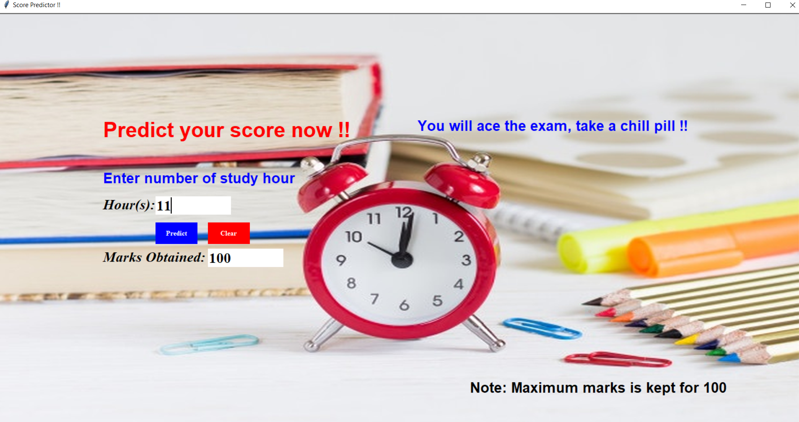
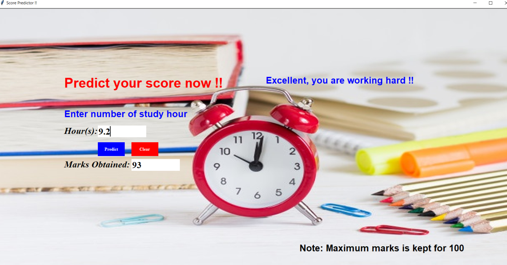
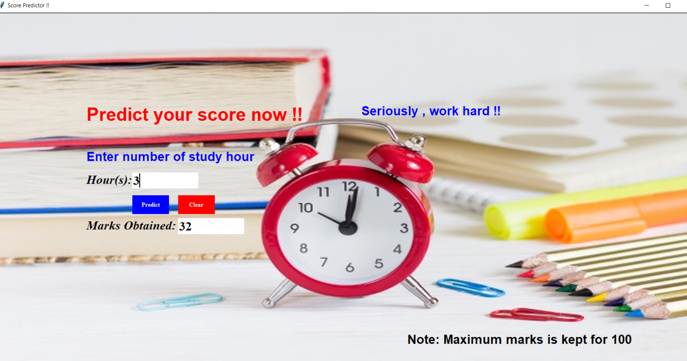

# Explore-Supervised-ML
 
> This project is all about predicting the score of a student based on the number of study hours
This can be visualised with the standalone application.
Techstack : Python.supervisedML,tkinter
Dataset : Created manually with attributes ( number of hours study, score )
This is a Supervised Learning. We have created 
GUI application using tkinter to predict the score for given input number of hours of study

## Tech stack
* Python
* Supervised ML
* tkinter

### Snapshots of the same

## Snapshot 1:

## Snapshot 2:

## Snapshot 3:
