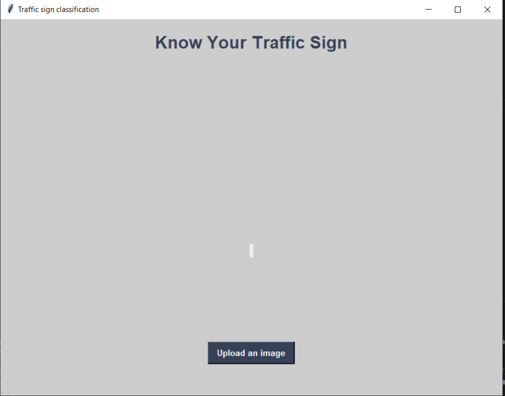
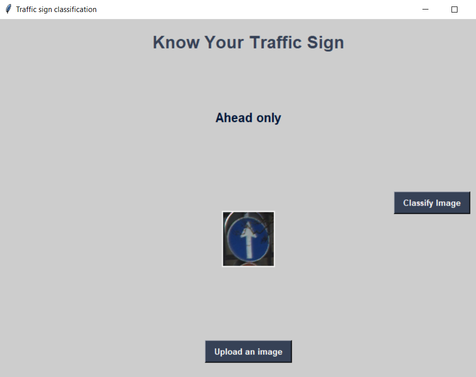
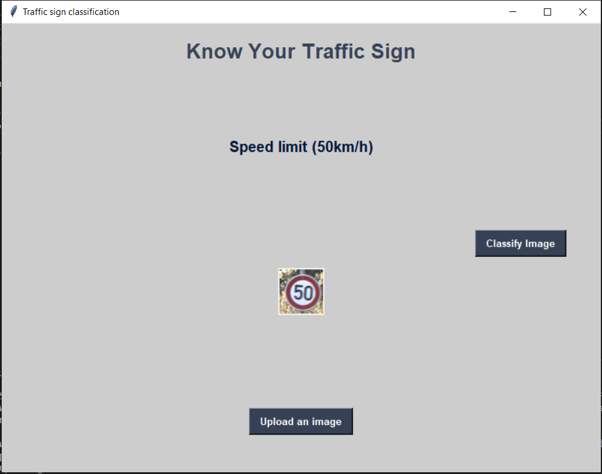

##  Traffic Sign Classification/Prediction

>Traffic sign recognition (TSR), taken as an important component of an intelligent
    vehicle system, has been an emerging research topic in recent years. Traffic signs
    classification is the process of identifying which class a traffic sign belongs to. Road Traffic
    accidents are one of the major reasons for deaths taking place in India. These accidents not
    only result in serious injuries but may also lead to deaths. Image recognition technology is
    one of the widely used techniques used in various fields in research like agriculture, medicine,
    automobile etc. Image recognition techniques are being used which are not only time
    consuming but also very simple to handle. It also provides improved algorithms, and makes
    them more and more efficient and robust. Principles of Convolution Neural Network are used.
    Its numerous applications in the domain of Image Processing helps to handle traffic sign
    recognition systems by indicating driverless vehicles about the approaching traffic signs and
    gives alerts to the vehicle. The proposed approach consists of building a model using
    convolutional neural networks by extracting traffic signs from an image using color
    information. We have used convolutional neural networks (CNN) to classify the traffic signs
    and we used color based segmentation to extract/crop signs from images.

## The GUI Tkinter for classifying the traffic sign

## Upload the image and classify

## Another example

