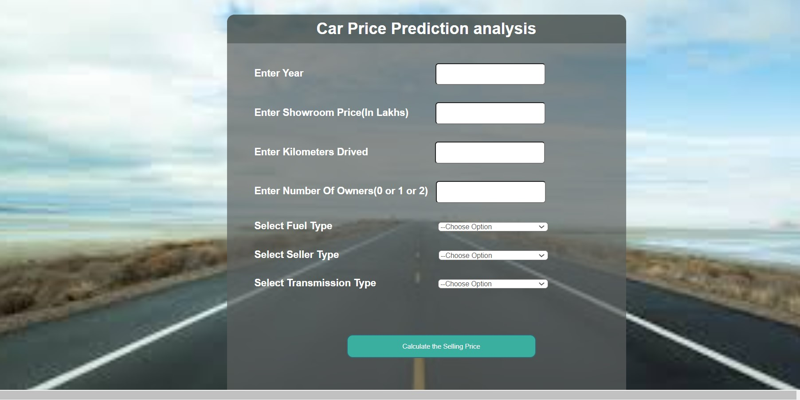

# Car-Price-Prediction-AI

### Depolyment

https://carpricepredict-api.herokuapp.com/

### App
A flask web app that predict the prices of cars using machine learning.

## Description :
### This is a project for visualization of various feature which are the sales price of the cars.

## Demo Image

## Requirements
### Flask==1.1.2
### gunicorn==20.0.4
### itsdangerous==1.1.0
### Jinja2==2.11.2
### MarkupSafe==1.1.1
### Werkzeug==1.0.1
### numpy>=1.9.2
### scipy>=0.15.1
### scikit-learn>=0.18
### matplotlib>=1.4.3
### pandas>=0.19

## How to Contribute:
### 1. Take a look at the Existing Issues or create your own Issues!
### 2. Preferably, you cannot work on any issue that is not assigned to you. Wait for the Issue to be assigned to you after which you can start working on it.
### 3.Fork the Repo and create a Branch for any Issue that you are working upon.
### 4. Make your changes.
### 5. Create a Pull Request which will be promptly reviewed and suggestions would be added to improve it.

### For more details visit [CONTRIBUTING.md](https://github.com/Jayshah6699/datascience-mashup/blob/main/CONTRIBUTING.md)

## Code of Conduct
### This project and everyone participating in it is governed by the [Code of Conduct](https://github.com/Jayshah6699/datascience-mashup/blob/main/CODE_OF_CONDUCT.md)

### Authors