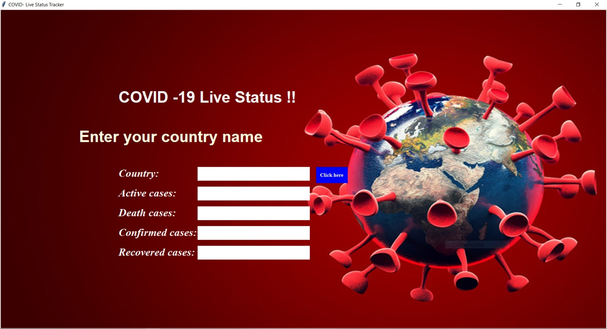
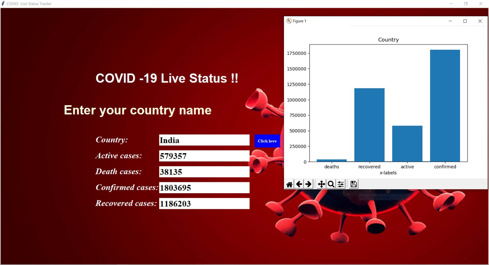

# COVID-19-Live-Status-Tracker

> This a tkinter GUI application where it provides the live status of active cases, confirmed cases, recovered cases and death cases for a given input country. The speciality is that for a given country a bar graph is generated indicating all the cases mentioned above.

## Tech stack used:

### 1. Tkinter
### 2. Python
### 3. matplotlib

## Screenshot-1

#### Shows the initial window to enter the country name

## Screenshot-2

#### After entering country live status is displayed along with the graph as shown below

### The graph can also be saved using save button